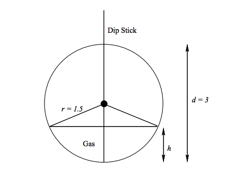

# Finding the Sagitta with Newton's Method
This was a fun geometric root finding problem I had in my numerical analysis class: 

Suppose you and your family are on a house boat trip in Lake Powell. Before you leave
the dock one of the mechanics tells you that the engines on your house boat will unfortunately stop working exactly when the gas tank is 3/8 full or less. After some arguing about getting another house boat, you decide to stick with this boat and to ensure that the tanks never get below 3/8 full. Once out on the lake, you realize the gas gauge is not working so you cannot tell how much gas is in the tank. You call the mechanic on your cell phone and she tells you to simply check the level of gas manually by using a dip stick. After locating the gas tank and a dipstick, you realize there is another problem: The gas tank is perfectly cylindrical (with a diameter of 3 feet) and lies horizontal to the water. Thus, when you measure the amount of gas, the length of the gas mark on the dipstick does not directly correspond to the amount of gas in the tank. For example, if the length of the mark is 3 * (3/8), this does not mean the tank is 3/8 full. Remembering that you brought your calculator with you on your trip, determine the length of the gas mark on the dipstick that corresponds to the tank being 3/8 full. The picture below may help you get started.

Please see the formulas pdf for a detailed derivation of necessary formulas